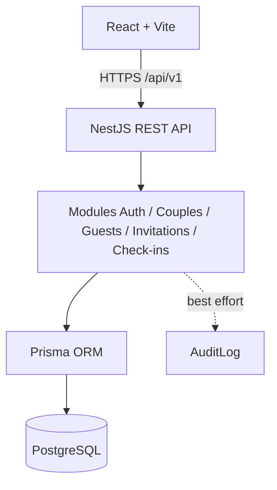
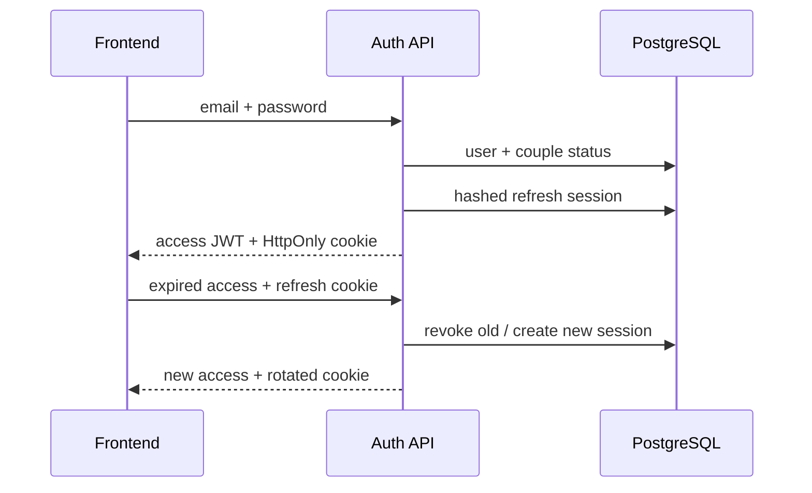
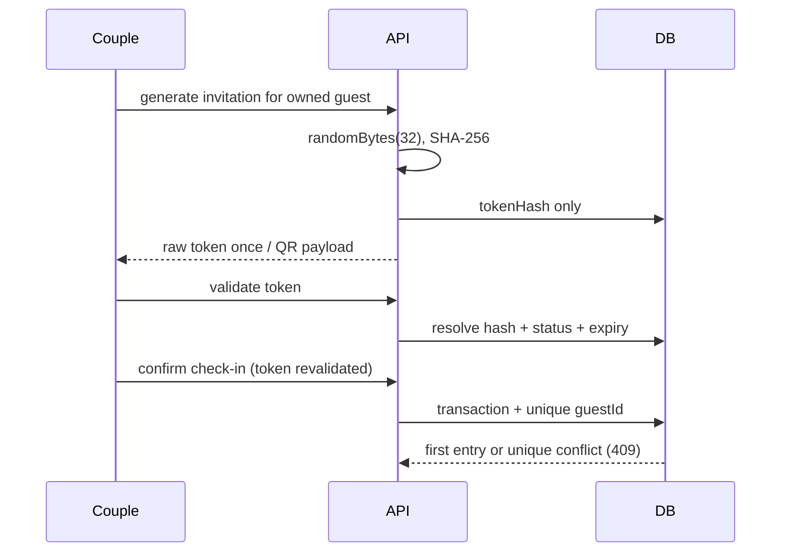

# Architecture

## Flux

Modules remain directly composed in one process. Tenant authorization occurs in services, not only routes. Audit writes are secondary/best-effort. Couple and Guest use controlled soft deletion; CheckIn and AuditLog are immutable operational records.
